# Smart Deck – UI Demo

A Flutter demo app showcasing a smart deck UI, possibly for a card or deck-based application.  
This is a **UI-only** project, with no backend or dynamic functionality.

---

## 📱 Overview

The app includes UI components for card decks, smart interactions, and card-based navigation.

---

## 🔍 Status

**Demo only** – No backend or working functionality.

---

## 📸 Screenshots

<table>
  <tr>
    <td>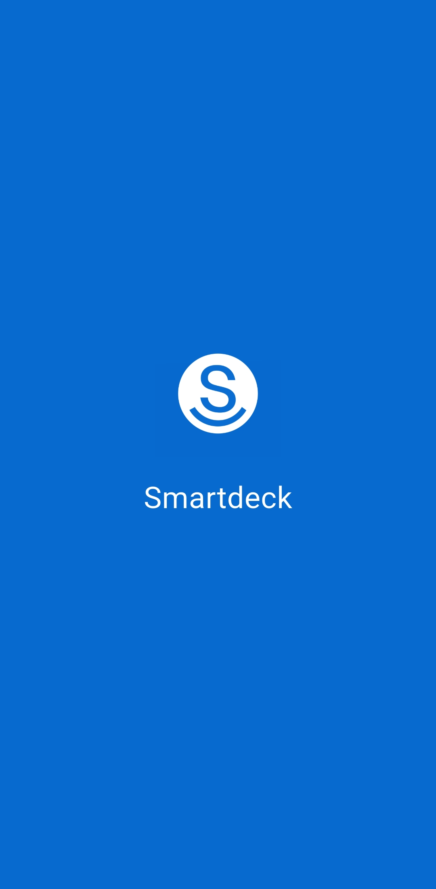</td>
    <td></td>
    <td>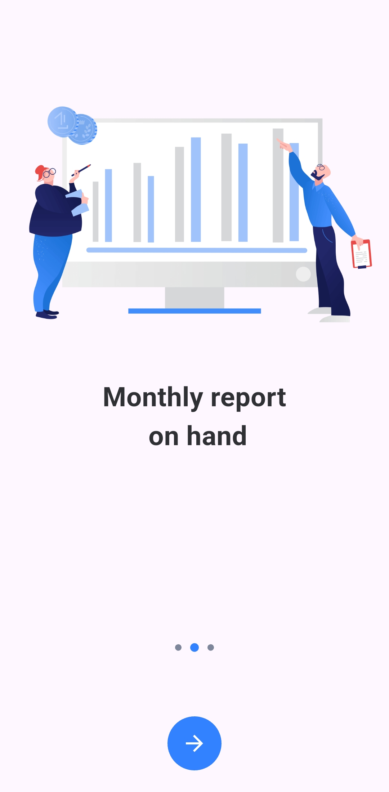</td>
    <td></td>
    <td>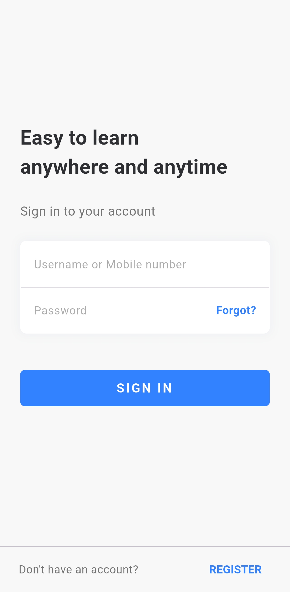</td>
  </tr>
  <tr>
    <td>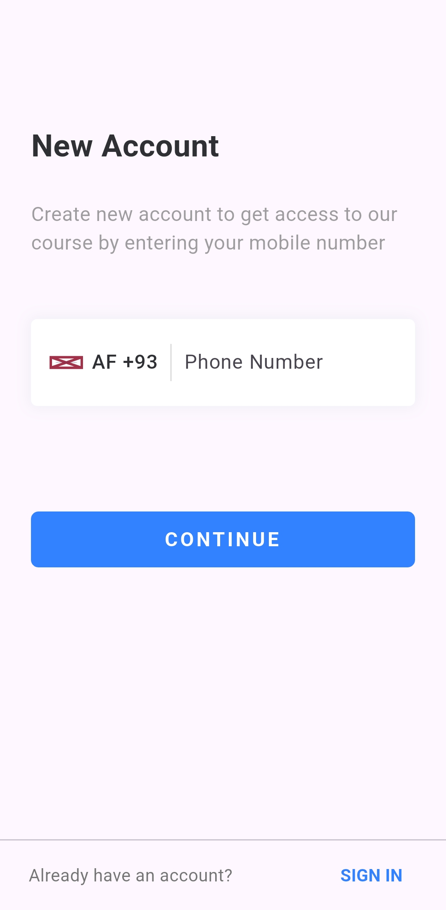</td>
    <td>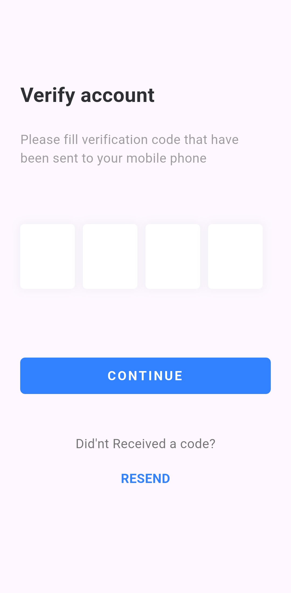</td>
    <td>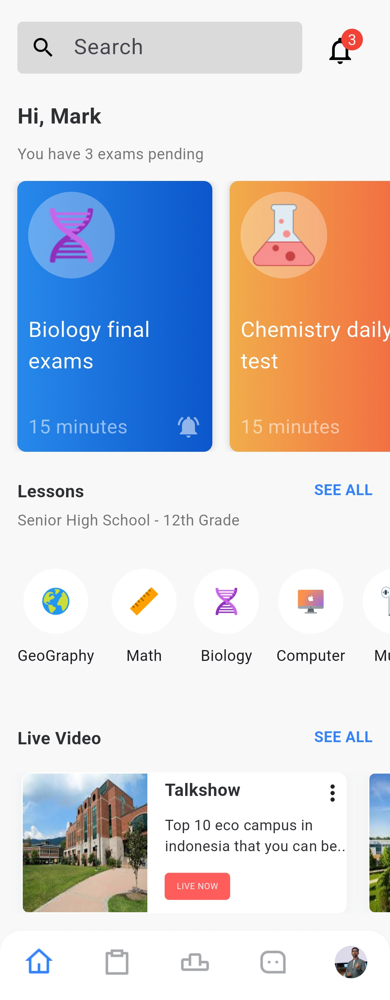</td>
    <td></td>
    <td>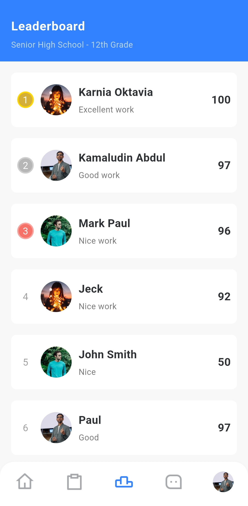</td>
  </tr>
  <tr>
    <td>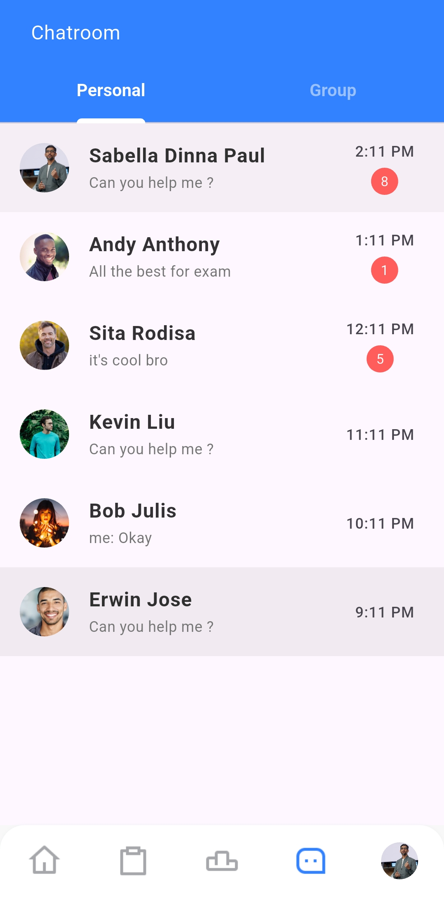</td>
    <td>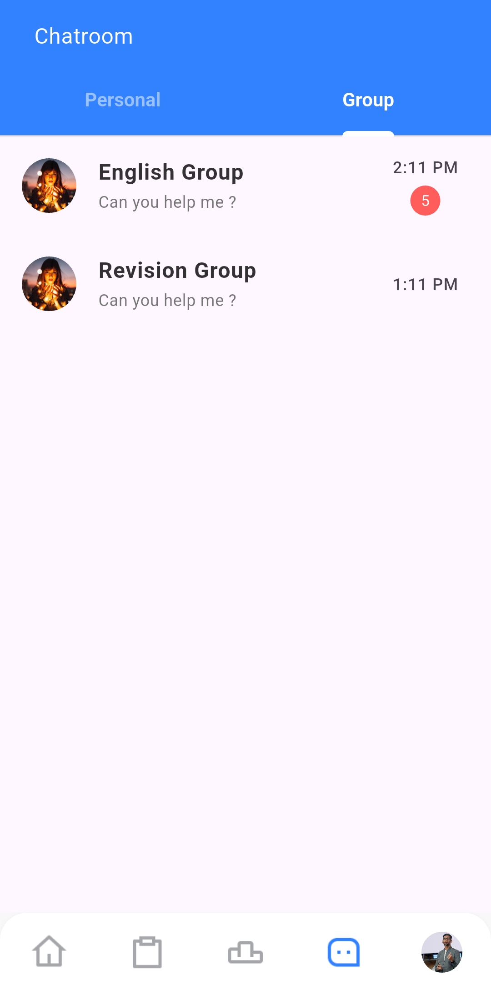</td>
    <td>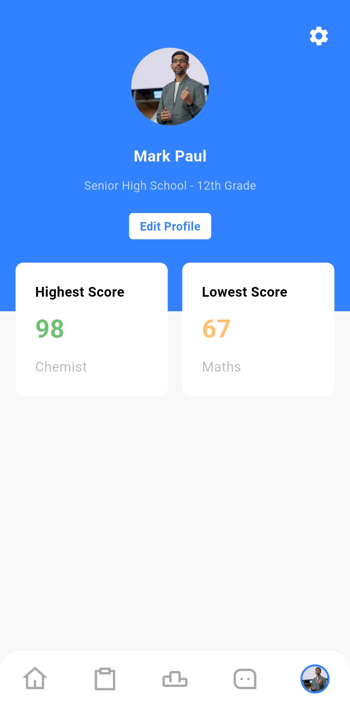</td>
    <td>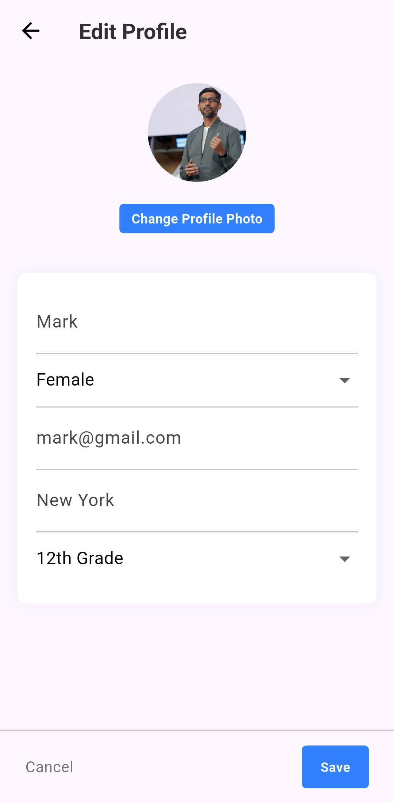</td>
    <td>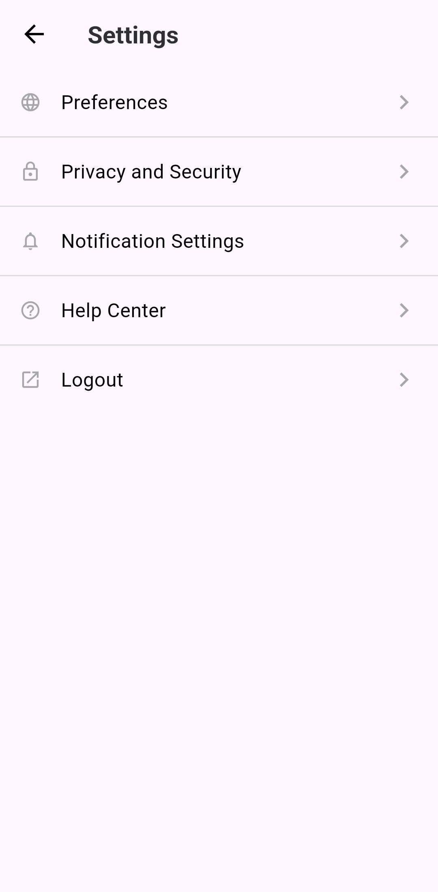</td>
  </tr>
  <tr>
    <td></td>
    <td>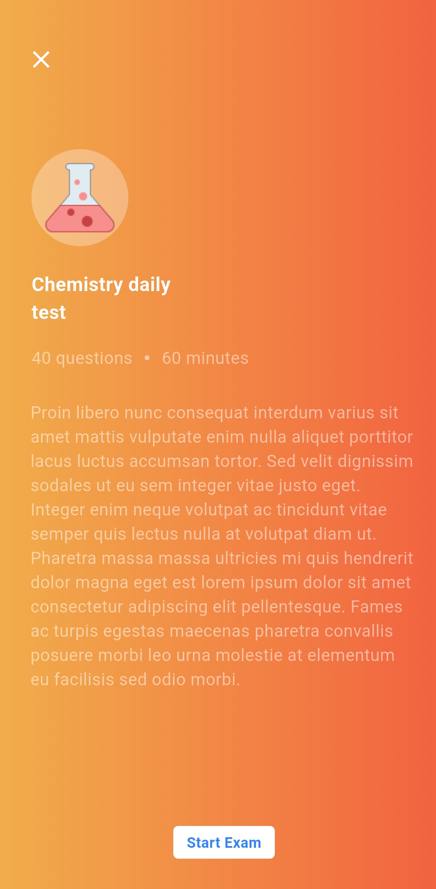</td>
    <td>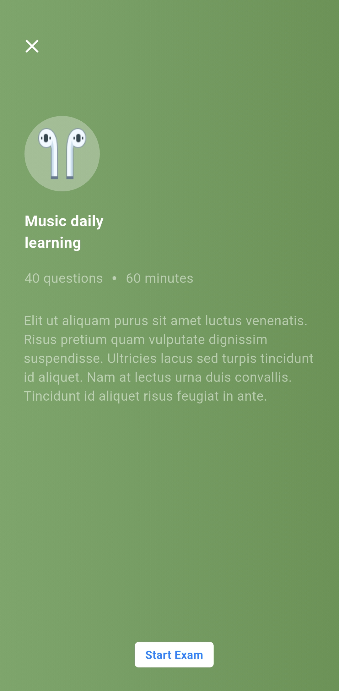</td>
    <td></td>
    <td></td>
  </tr>
</table>

---

## 📝 Notes

- Built entirely with Flutter
- Clean, modular UI components
- Great starting point for any card or deck-based app

---

## ✍️ Created by

**Mohamed Ebrahim**
